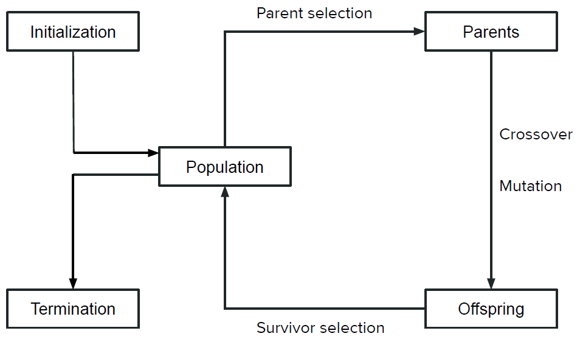

# Genetic Inverse Kinematics
Finding inverse kinematic solutions for over-actuated 2D robot arms using genetic algorithms. A project for Advanced Algorithms at Olin College of Engineering by [Charlie Mawn](https://github.com/c-mawn) and [Dominic Salmieri](https://github.com/joloujo).

## Writeup

### Genetic Algorithms
<!-- Introduce the algorithm(s) you are exploring and the background -->
Genetic algorithms are a subset of evolutionary algorithms, and take inspiration from natural selection and genetics[4]. They are often used to approximate optimal solutions to optimization problems with especially complex search spaces since they can be faster and more resistant to local minimums than alternatives like gradient descent.

Genetic algorithms treat possible solutions as individuals in a population, and then simulate the natural selection of these individuals over many generations. Each individual is represented by a 'chromosome', which is most commonly a string of bits.

Generically, genetic algorithms look like the following diagram. 

*Figure 1: Genetic algorithm diagram[3]* 
<!-- TODO: Needs citation -->

First, the population is initialized. Then the algorithm enters a loop of selecting parents, creating children, slightly changing those children, and reselecting the population. The algorithm leaves this loop when it meets it's termination criteria.

The core of a genetic algorithm is it's fitness function, which is a measure of how good a solution is. By finding the fitness of all of the individuals in the population, the algorithm can compare individuals and find ones that are closer to a good solution. The fitness function can be used in any of the previously mentioned steps.

<!-- Introduce the context you are exploring your algorithm in -->

### Robot Arms and Genetic Algorithms

Oftentimes, with a robot arm, you want to make the end effector go to a specific location or pose. The problem with this is that you only have control over the angles of the individual joints, so you need to somehow calculate the proper joint angles that will get the end effector to the location you want. This is called inverse kinematics.

There are several ways to solve the inverse kinematics of a robot. You can solve trigonometrically, and get an exact analytical solution, but this is only possible for certain robot arm configurations. Plus, if the number of degrees of freedom are different than your number of joints, you'll either have impossible cases or cases where there are infinite solutions. You can solve numerically by doing gradient descent, but this is susceptible to local minimums. 

We wanted to try using genetic algorithms to find solutions, which we hoped would be faster and more reliable than these other methods. Not only that, our solution would be able to handle over-actuated robot arms, which can have infinite valid solutions for one location.

### Solving YOUR Problem / How It Works
- Explanation of components of the algorithm
- Detailed contextualization of the algorithm to the problem, including detailed descriptions of any named variables
- Detailed explanation of encoding the problem
- At least two diagrams or other form of detailed description

### Results 
- Visualization of results provided in some format
- Any technical reader can garner understanding of what your algorithm’s implementation produced

### Analysis
- Description of what results mean
- Examples:
  - Graphs showing comparisons of varying results
  - Performance metrics
- Shows and analyzes how good the solutions are and how quickly solutions are found
- Comparison of methods used with results to back up

### Next Steps
<!-- 
  - Delineation of potential next steps
  - Areas you would have explored with more time
  - How your solutions may scale to other problems
  -->

There are many ways we could continue developing this project. The most obvious is to expand from 2D to 3D. This would require fundamental restructuring of our code, though, and would also increase the complexity significantly, as we would have to use generalized high-dimensional rotations and not just angles. Not only that, but we would have to worry about 6 degrees of freedom (3 translational and 3 rotational) and not just 3 (2 translational and 1 rotational).

One thing we would have done if we had more time is modify our fitness function to take into account things besides just distance from the goal. For example, we could have made it so that the arm crossing itself was penalized so that we arm configurations that could feasibly exist in 2D space. We could have added a goal orientation as well to make the end effector point in a specific direction. 

We could even have used the fitness function to change how the arm behaved. For example, we could have incorporated the joint angles and incentivized the angles being close to zero to prevent the arm from doubling back on itself, or take into account the position of other joints to make the arm point towards the goal as early as possible.

Another constraint we didn't have time to add was obstacles. While it makes them much more complex, one of the advantages of over-actuated robot arms is that they have many solutions for one pose, and you can pick a solution that has other good features, like avoiding obstacles. We were hoping to add walls to our simulation, but didn't have the time.

A stretch goal we considered was applying this technique to velocity kinematics. Just like how you can relate the position of the end effector to the joint angles, you can relate the velocity of the end effector to the angular velocity of the joints. When you are able to control the velocity of a robot arm, you can control it's continuous motion and not just it's position. This makes it possible to do things like trajectory generation, which is an important part of robot arm control. 

This approach may not scale well to velocity, though. The velocity kinematics depend on both the angle and angular velocity of the joints. This means that as the joins move, you need to recalculate your kinematics, and to get smooth and accurate movement, you would need to perform these calculations as close to continuously as possible. This approach may simply not be fast enough for effective control. 

The use of genetic algorithms in robotics is an area that has been thoroughly studied. For example, Nearchou 1998 [2] solves a very similar problem to ours. In this paper, a genetic algorithm is used to find successive inverse kinematic solutions to a redundant robot, which are then interpolated between, to do a form of trajectory generation in complex environments. Another example is Momani et. al. 2016 [1]. This paper compares a classical genetic algorithm with a continuous genetic algorithm in the context of solving inverse kinematic trajectory generation problems for robot arms.

### Citations
<!-- Bibliography contains at least 5 sources total cited in any official format; just be consistent (use IEEE if you cannot think of any) -->
<!-- In-line citations matching selected official format style -->
[1] S. Momani, Z. S. Abo-Hammour, and O. MK. Alsmadi, “Solution of Inverse Kinematics Problem using Genetic Algorithms,” Applied Mathematics & Information Sciences, vol. 10, no. 1, pp. 225–233, Jan. 2016. 

[2] A. C. Nearchou, “Solving the inverse kinematics problem of redundant robots operating in complex environments via a modified genetic algorithm,” Mechanism and Machine Theory, vol. 33, no. 3, pp. 273–292, 1998. 

[3] R. Dave, A. Rattan Singh Sandhu, A. Vinod, and M. Cranor, “Day 0 Genetic Algorithms-2,” in Special Topics in Computing - Advanced Algorithms with Math, Apr. 4, 2025 

[4] GeeksforGeeks, “Genetic algorithms,” GeeksforGeeks, https://www.geeksforgeeks.org/genetic-algorithms/ (accessed Apr. 29, 2025). 

### *Quality*
- *Clear narrative thread throughout the writeup*
- *No/minimal spelling & grammar mistakes*
- *Writing makes sense*
- *Writing is professional*
- *Writeup is portfolio ready!*
- *Clean, accessible to outsiders, highlights hard work*

## Setup

This project was developed and tested in Python 3.10+. We recommend using a virtual environment.

The necessary packages are `numpy` and `matplotlib`. `pip-tools` is an optional but recommended command line tool we use to manage package and subpackage versions.

**To install the necessary requirements, use `pip install -r requirements.txt` in the command line.**

If you change the requirements, you can rerun that command to install the new packages, or use `pip-sync` from pip-tools in the command line to also uninstall unnecessary packages or versions. If you need to add new packages, you can add them to `requirements.txt` directly, or just put the package name in `requirements.in` and use `pip-compile` from pip-tools in the command line to autogenerate a requirements file that ensures all package and subpackage versions work well with each other.

## Usage

After insalling necessary packages, run the algorithm by using `python3 src/main.py` in the command line. 

To change parameters of the genetic algorithm, go to the bottom of `main.py` and alter the arguments passed into the `run_ga` function. 
